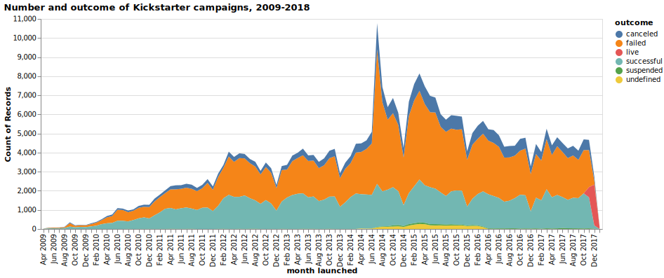
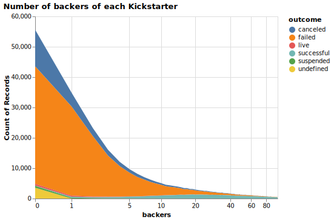

The Kickstarter data I use was obtained from the Kaggle dataset: https://www.kaggle.com/kemical/kickstarter-projects. Kickstarter is an online, international crowdfunding website, where users can launch campaigns to raise money for various causes and projects. A campaign is launched with a certain goal amount. People pledge money to the campaign (i.e. promise to give the campaign money if it's successful), which is successful only if it reaches the goal. Kickstarter is all-or-nothing, so if the goal amount is not reached, the campaign fails. This dataset contains information on 378,661 Kickstarter campaigns launched from 2009 through the end of 2017, after filtering out the seven campaigns with launch years of 1970. Each project is associated with a launch date, country, goal amount to raise, amount actually raised (or the amount "pledged"), a main, more general category, sub-categories of those general categories, and number of backers. All amounts are in US dollars, using the more realistic conversions provided in the dataset that were converted using the Fixer.io API. I used a tooltip for some plots but had trouble rendering them in a notebook that displays on Github, so these are all static images. I will start with more basic, exploratory questions to guide the visualizations, which eventually lead to more complicated questions that I am most interested in answering.

## How has the number of Kickstarter campaigns changed over time?



## How often are projects successful by meeting their goal?


Failed campaigns didn't meet their goal and are no longer running, successful projects are no longer running and met their goal, canceled projects were canceled by the organizer, undefined projects are a data error or projects not yet launched, live projects are projects are still active when the data was collected, and suspended projects were canceled by Kickstarter.

## In what countries is Kickstarter most popular?


## Are there daily trends in time campaigns are launched and how much ends up being pledged?


The dataset doesn't include the time zone, but based on the daily trend in launch time in the US, I think it is UTC. Projects launched during the early morning hours in the US have the largest amounts pledged (region shows interquartile range with median as the blue line). 


Number of campaigns launched in each general main Kickstarter category.



Most campaigns have very few or no backers (people who pledge to the campaign). There is a very long, thin tail so only up to 100 backers are plotted.

## Are some categories more likely to have smaller donations per backer?


The blue shaded box on the left panel corresponds to the zoomed-in region plotted in the right panel. The black line indicated median value for each general main Kickstarter category.

## Are there any relationships between a project's goal and the amount pledged?


The region to the left of the diagonal is a project that didn't meet its goal, and the diagonal is exactly the goal amounted that was raised. Many projects raise very little, but those that get close to the goal are more likely to surpass it than just fall short. You see increased density along horizontal lines corresponding to round numbers for the campaign goal (e.g. 500, 300, 200, 100).  

## What types of campaigns raise the most pledge money?


Each dashed line corresponds to a single campaign, with each row as one of the general main Kickstarter categories. Note despite raising a large amount of money, not all projects are classified as successful (e.g. it would have the state "failed" if it raised any amount of money but didn't reach its goal).


The colored lines span the interquartile range, with the median indicated by a black point. Each specific category has a more general parent category which is encoded by the color. 


```python

```
